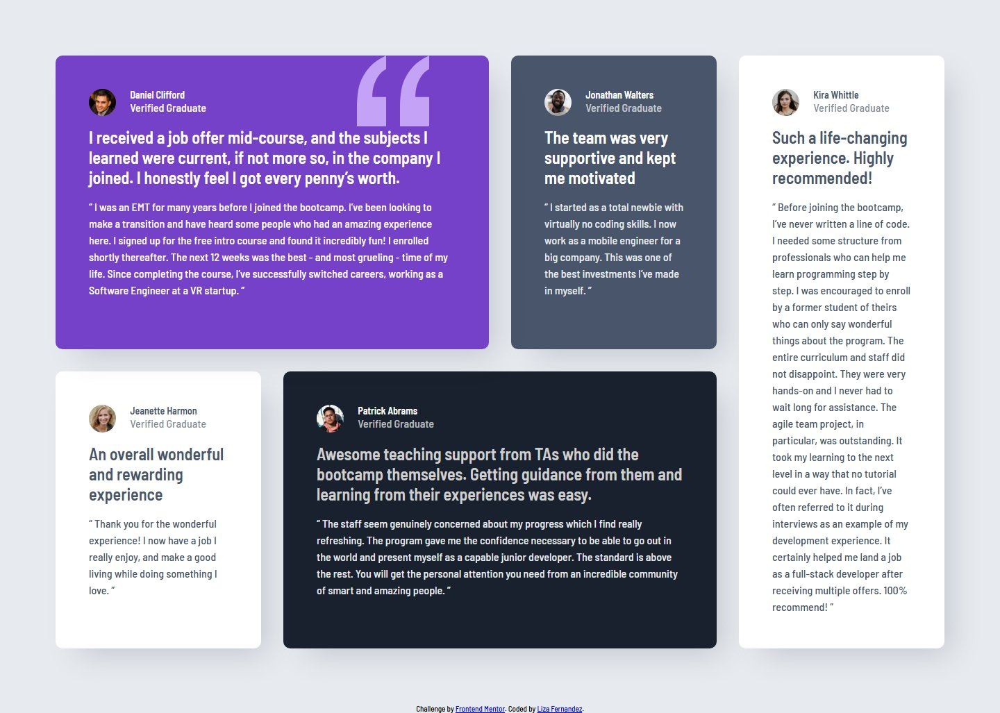
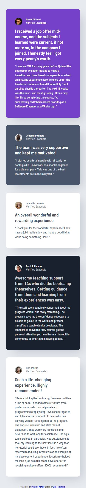

# Frontend Mentor - Testimonials grid section solution

This is a solution to the [Testimonials grid section challenge on Frontend Mentor](https://www.frontendmentor.io/challenges/testimonials-grid-section-Nnw6J7Un7). Frontend Mentor challenges help you improve your coding skills by building realistic projects.

## Table of contents

- [Overview](#overview)
  - [The challenge](#the-challenge)
  - [Screenshot](#screenshot)
  - [Links](#links)
- [My process](#my-process)
  - [Built with](#built-with)
  - [What I learned](#what-i-learned)
  - [Continued development](#continued-development)
  - [Useful resources](#useful-resources)
- [Author](#author)
- [Acknowledgments](#acknowledgments)

## Overview

### The challenge

Users should be able to:

- View the optimal layout for the site depending on their device's screen size

### Screenshot

**Desktop Preview**



**Mobile Preview**



### Links

- Solution URL: [Add solution URL here](https://your-solution-url.com)
- Live Site URL: [https://testimonial-grid-section-lf.netlify.app](https://testimonial-grid-section-lf.netlify.app)

## My process

### Built with

- Semantic HTML5 markup
- CSS Grid
- Mobile-first workflow
- SASS

### What I learned

Some of my major learning outcomes from working on this solution, were improving my skills in using CSS grids and my knowledge on the accessibility of websites. To help identify how to improve the accessibility of my website, I utilised the Gemini AI Assistant Extension for VS Code, to provide me information on what I can do to improve my solution.

These accessiblity improvements included ensuring my solution meets the WCAG guidelines for the contrast ratio between the Foreground and Background colours. Another was the addition of a clear and visible focus state for users to navigate with a keyboard, particularly for the links on the solution page.

Another major learning outcome was how to use a background image while also changing its colour. Through the use of Gemini AI Assistant, I was able to ask it to provide a method for doing so. This involved using a mask to add the image instead of the background-image property. The code and comments of how the code works as follows:

```scss
/* Background images i.e. SVG should be added via a mask to allow the color of the image to be changed */

#daniel-clifford {
	position: relative; /* creates positioning context for following pseudo element*/
	> * {
			position: relative;
			z-index: 2; /* places pseudo-element behind the card's text to ensure it stays in the background */
		}
	}

@media only screen and (min-width: 1024px) {
	 &::before { /*pseudo-element */
	        content: "";
	        position: absolute;
	        top: 0;
	        right: 10%;
	        width: 8rem;
	        height: 7.85rem;
	        background-color: $purple-300;
	        mask: url("../images/bg-pattern-quotation.svg") no-repeat; /*
	        with this, SVG's shape is used to cut-out a visible area from pseudo element*/
	        z-index: 1;
	        }
	       }
```

### Continued development

For future projects, I would like to focus more on improving the accessibility of my websites, and using more SASS. For SASS, I used Gemini AI Assistant to identify how this solution could use SASS. One feedback I received was to use SASS maps for to centralise the unique properties of the card elements, to make the code more easier to manage. While it provided me the code to do so, I didn't fully understand it as it's a new concept for me. Thus, I opted not to add it to this solution and will try to use it in future projects, and eventually revisit this solution and add it.

Other feedback regarding SASS, was the use of @each loops to automatically generate the CSS for each card and mixins for responsive breakpoints. Similarly to the previous feedback on SASS and maps, I opted not to add it to this solution due to my lack of understanding of the concepts and thus will be concepts I will focus on in future projects.

### Useful resources

- [VS Code Gemini AI Assistant](https://marketplace.visualstudio.com/items?itemName=Google.geminicodeassist) - Used to help solve some challenges that I came across. Also used to help identify how to improve my code, such as getting the design close to the original and how to improve the accessibility of the website. Going forward I will use this more often to receive feedback on my code, while also ensuring I do not rely on the code it generates too frequently or at least ensure I fully understand how the generated code works before using it.
- [nekoCalc](https://nekocalc.com/px-to-rem-converter) - A common resource I use, to convert px to rem for improved responsive websites.

## Author

- Website - [Liza Fernandez](https://lizafernandez.dev)
- Frontend Mentor - [@aelvanna](https://www.frontendmentor.io/profile/aelvanna)

## Acknowledgments

Google for their Gemini AI Assistant, which was helpful for improving my code and providing solution to any challenges that arose in the process of completing this challenge.
